# Deploying and Benchmarking Classifier with LitServe 🚀

## Introduction to LitServe 🌟  
LitServe is a lightweight framework designed for serving machine learning models with **high performance** and **scalability**. It simplifies the deployment of models, allowing developers to focus on building and optimizing their applications. With LitServe, you can easily expose your models as APIs, enabling seamless integration with various applications.  

```bash
pip install litserve
```


## Why LitServe? 🤔  

### LitServe vs Other Frameworks 🏆  
- **Ease of Use**: Simple to set up and deploy.  
- **Performance**: High throughput with minimal latency.  
- **Batching**: Built-in support for batching, ensuring efficient GPU utilization.  


## LitAPI 

### Key Lifecycle Methods 🛠 
- **`setup()`**: Initializes resources when the server starts. Use this to:
  - Load models 
  - Fetch embeddings   
  - Set up database connections   

- **`decode_request()`**: Converts incoming payloads into model-ready inputs.  
- **`predict()`**: Runs inference on the model using the processed inputs.  
- **`encode_response()`**: Converts predictions into response payloads.  

### Unbatched Requests   
The above methods handle one request at a time, ensuring low-latency predictions for real-time systems.  

## Batched Requests  

Batching processes multiple requests simultaneously, improving GPU efficiency and enabling higher throughput. When batching is enabled:  
1. **Requests** are grouped based on `max_batch_size`.  
2. **decode_request()** is called for each input.  
3. The **batch** is passed to the `predict()` method.  
4. Responses are divided using **unbatch()** (if specified).  


## LitServer   
LitServer is the core of LitServe, managing:  
- Incoming requests  
- Parallel decoding  
- Batching for optimized throughput  


## Hands-On with LitServe ✋  

### Step 1: Start an EC2 Instance on AWS ☁️  
- Instance type: **g6.xlarge**  
- Activate your environment:  
  ```bash
  source activate pytorch
  ```  

 **Verify GPU availability** using `nvidia-smi`:  

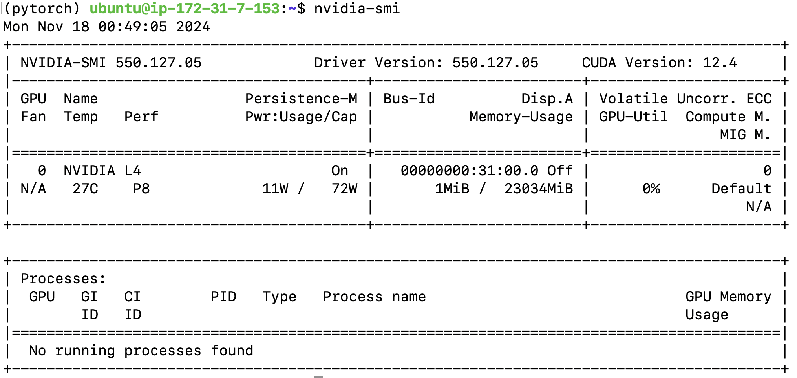  


### Step 2: Deploy the Cat-Dog Classifier 🐱🐶  
Run the server script:  
```bash
python aws-litserve/server.py
```

### Step 3: Benchmark Performance   
Evaluate the server's performance with:  
```bash
python aws-litserve/benchmark.py
```  


## Server Code Highlights 🔍  

### Server Initialization   
```python
api = ImageClassifierAPI()
server = ls.LitServer(
    api,
    accelerator="gpu",
)
server.run(port=8000)
```

### Image Processing Workflow  
- **Decode**: Convert base64 images to tensors.  
- **Predict**: Run inference using `softmax` probabilities.  
- **Encode**: Return top predictions with their probabilities.  

## Benchmarking the API ⚡  

### Baseline Throughput  
Measure model throughput without API overhead:  
```python
batch_sizes = [1, 8, 32, 64]
for batch_size in batch_sizes:
    throughput = get_baseline_throughput(batch_size)
    print(f"Batch size {batch_size}: {throughput:.2f} reqs/sec 🚀")
```

### API Performance Evaluation   
Benchmark the deployed API for **concurrency levels**:  
```python
concurrency_levels = [1, 8, 32, 64]
for concurrency in concurrency_levels:
    metrics = benchmark_api(num_requests=128, concurrency_level=concurrency)
    print(f"Concurrency {concurrency}: {metrics['requests_per_second']:.2f} reqs/sec 🏆")
```

### Performance Metrics  
- **Requests per second**: Throughput achieved at different batch sizes.  
- **CPU & GPU Usage**: Average utilization during benchmarking.  
- **Response Time**: Average latency per request.  

## Sample Outputs 

### Server Logs  

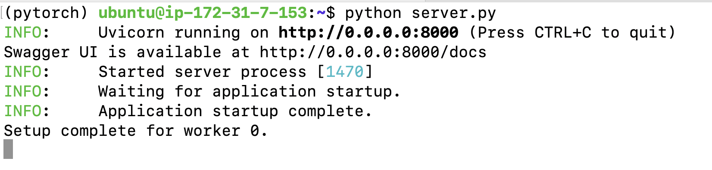

### Test Client Predictions  
Using `test_client.py` to get predictions for a test image:  

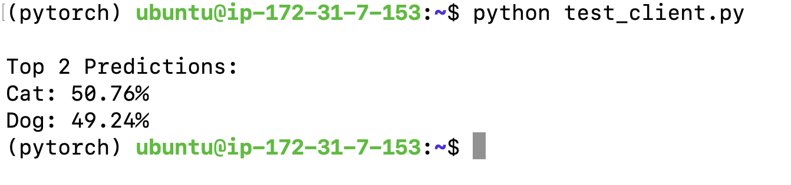  

### Benchmarking Results  

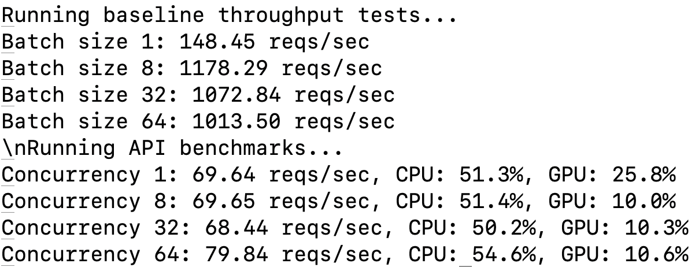

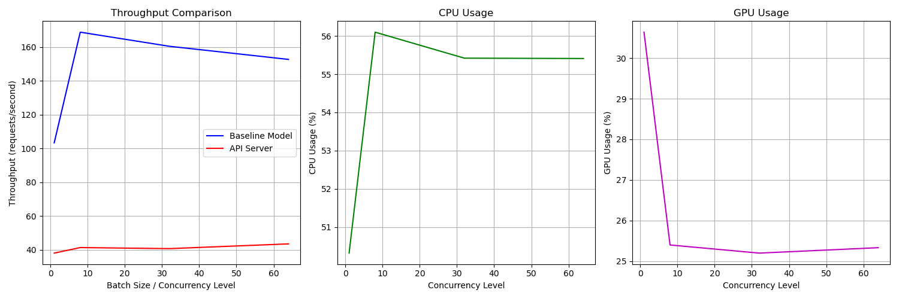


## Configuration Options

### 1. Batching Configuration
Batching allows processing multiple requests simultaneously for improved throughput:

```python
server = ls.LitServer(
    api,
    accelerator="gpu",
    max_batch_size=64,     # Maximum batch size
    batch_timeout=0.01,    # Wait time for batch collection
)
```
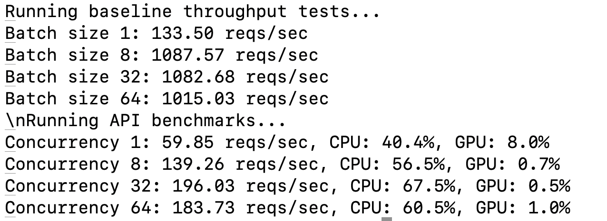

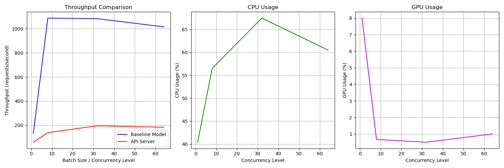

Key batching parameters:
- `max_batch_size`: Maximum number of requests in a batch (default: 64)
- `batch_timeout`: Maximum wait time for batch collection (default: 0.01s)
- `batching`: Enable/disable batching feature

### 2. Worker Configuration
Multiple workers handle concurrent requests efficiently:

```python
server = ls.LitServer(
    api,
    accelerator="gpu",
    workers_per_device=4,  # Number of worker processes
)
```
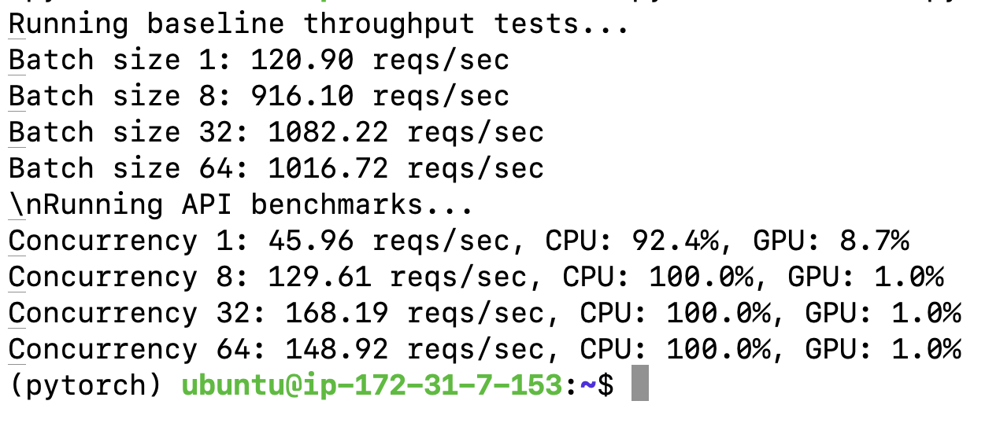

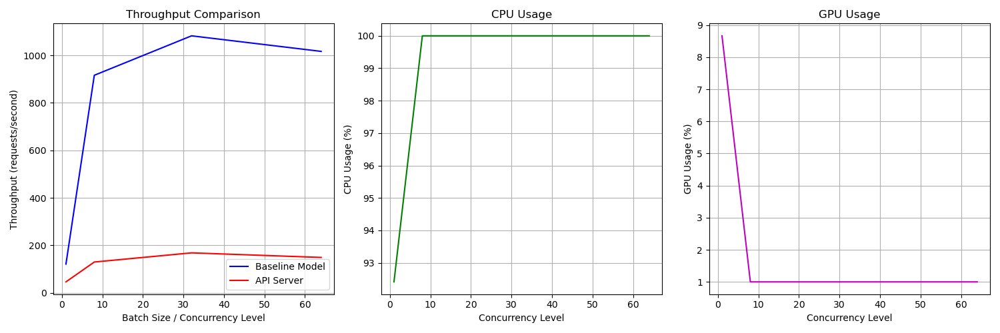

Worker guidelines:
- Start with `workers_per_device = num_cpu_cores / 2`
- Monitor CPU/GPU utilization to optimize
- Consider memory constraints when setting max_workers

### 3. Precision Settings
Control model precision for performance/accuracy trade-off:

```python
# Define precision - can be changed to torch.float16 or torch.bfloat16
precision = torch.bfloat16
```
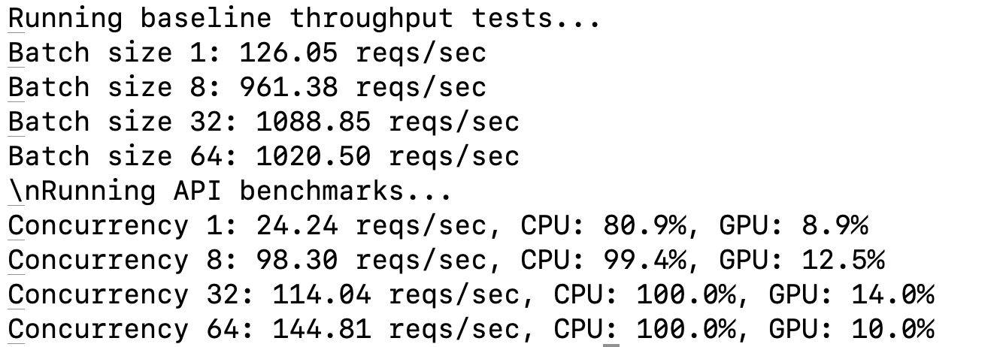

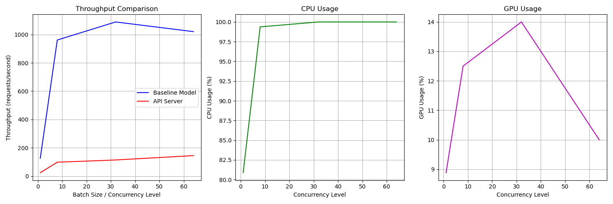

Precision options:
- `half_precision`: Use FP16 for faster inference
- `mixed_precision`: Combine FP32 and FP16 for optimal performance